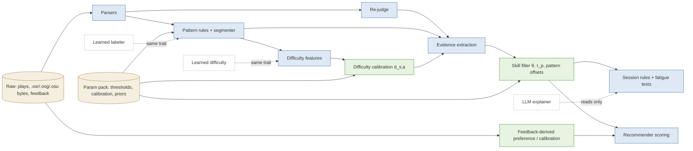
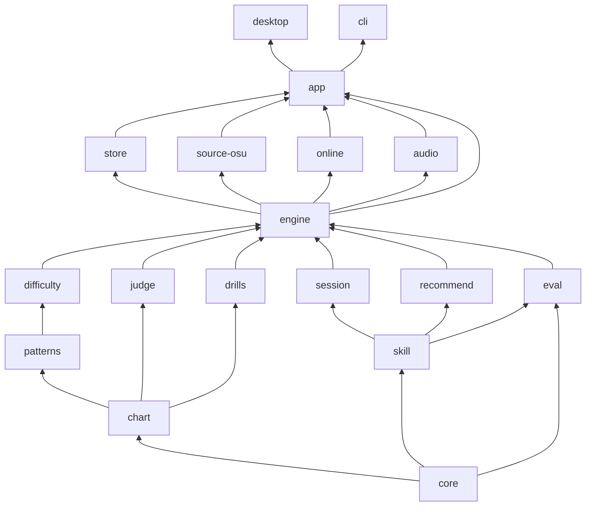

# wolluf — Architecture

Status: baseline, accepted 2026-09-28. This is a living document: change it through an ADR (`docs/adr/`) and keep it current.
Scope: osu! stable data source. 7K is the first target, but every part is keymode-generic. The design is solo-dev sized.
Companion documents: `docs/research/` holds the verified domain findings, `docs/adr/` holds the decisions, and `docs/conventions.md` holds the rules.

---

## 1. Goals and non-goals

### Product goals
wolluf diagnoses weaknesses per pattern from replays and tracks skill per session. It recommends a chart, a section and a rate, and cuts drills. All of this runs from local osu! stable files. The research plan has the details.

### Architecture goals

| # | Goal | What makes it true |
|---|---|---|
| G1 | Every derived number can be reproduced from raw observations, code version and param pack. | Raw-vs-derived split, content-addressed vault, per-row version keys, CI stage-lock (§5, §10) |
| G2 | Adding a keymode (4K) or a game (Etterna, Quaver, BMS) means adding data and implementations. Nothing downstream is rewritten. | Keymode profiles as data, compile-time registry, neutral `Evidence` record, `meta_*` IPC (§5, §9) |
| G3 | Skill is always computed for a selected identity set. Other players' plays stay viewable but never contaminate self skill or telemetry. | Profiles/scopes, scope-independent evidence, typed `SelfScope` + `ConsentToken` (§5, §6) |
| G4 | User feedback improves the model at three levels (per-user online, per-user calibration, global params). An offline eval gate approves every change. | Feedback ledger, prequential logging, param packs, eval suites (§6) |
| G5 | A solo dev keeps shipping features without the codebase rotting. | Few crates at start, compiler-enforced boundaries, pure fast tests, one CLI for harnesses, vertical feature slices (§3, §4) |
| G6 | The osu! folder is read-only except for one confirmed export path. Privacy is enforced by types, not by discipline. | `ExportPermit` and `ConsentToken` with private constructors, compile-fail tests (§4, §6) |

### Non-goals, each rejected with a reason
- **Deep learning in the MVP.** One player has ~4.3k plays. A Bayesian filter beats a neural model at that data volume (§2).
- **Event bus, CQRS, microservices, dlopen/WASM plugins, persistent job queue.** Nobody else writes plugins, and staleness is recomputed at startup, so the queue can live in memory.
- **Server-side skill computation, multi-device sync, usage analytics.** Skill is computed locally. The only thing that ever leaves the machine is opt-in model telemetry.
- **A telemetry backend before there are ~10 real opt-in users.** The *local* capture schema exists from day 1, so no signal is lost while the backend is missing.
- **osu! API usage beyond the logged-in user's own `/me`,** and any use of data.ppy.sh dumps in production.
- **Live memory reading.** tosu is optional and runs as a separate process (LGPL/GPL isolation).

### The shape in one picture

```
            ┌───────────────────────── shells (no logic) ─────────────────────────┐
            │   apps/desktop (Tauri 2 + React)            apps/cli (wolluf)       │
            └───────────────────────────────┬─────────────────────────────────────┘
                                            │ calls
            ┌───────────────────────────────▼─────────────────────────────────────┐
            │ wolluf-app: vertical feature slices (players, library, skill, ...),  │
            │ job runner, typed safety gates (ExportPermit, ConsentToken)          │
            └───┬───────────────┬──────────────┬───────────────┬──────────────────┘
                │               │              │               │
          wolluf-store   wolluf-source-osu  wolluf-online   wolluf-audio      (IO adapters)
          (all SQL)      (read-only osu!)   (/me, telemetry) (F4)
                │               │              │               │
            ┌───▼───────────────▼──────────────▼───────────────▼──────────────────┐
            │ wolluf-engine: registry, keymode profiles, EngineManifest, stage DAG │
            └───┬──────────────────────────────────────────────────────────────────┘
            pure, deterministic domain crates: chart · patterns · difficulty · judge ·
            skill · session · recommend · drills · eval  ──►  wolluf-core (types)
```

---

## 2. Algorithm vs statistical model vs ML

**Short answer:** wolluf is **not an AI**. It has two kinds of "brain":
- **deterministic algorithms**, which are readable rules;
- **small statistical models**, a few hundred to a few thousand meaningful numbers re-estimated from data.

The part that "learns from feedback" is the statistics. Each re-estimate is checked automatically: it must predict better than the numbers it replaces. Larger ML can plug in later behind the same interfaces, and only if it wins that same check.

### A. Deterministic algorithms (fixed rules; same input always gives the same output)
They change only when someone edits code, which bumps a stage `VERSION`.

| Component | Crate | Example |
|---|---|---|
| File parsing (.osu, .osr, .osg, osu!.db, scores.db, collection.db, cfg) | `source-osu`, `chart` | "bytes → Chart rows" |
| Replay re-judging (hit windows, notelock, V1/V2) | `judge` | "key-down 38 ms late at OD8 → 200" |
| Pattern detection and segmentation | `patterns` | "3 notes, same column, <150 ms apart at 7K → minijack" |
| Difficulty *features* (Sunny strain terms, density, chord structure) | `difficulty` | "segment strain = …" |
| Session segmentation, fatigue tests (CUSUM/EWMA), report decision rules | `session` | "improved (provisional) needs P ≥ 0.80" |
| Drill cutting and timing rewrite | `drills` | `t' = O_k + (t − (a − p))/r` |
| Recommendation candidate generation and scoring formula | `recommend` | "score = purity × closeness × info × goal" |

Rules contain **thresholds** (the "150 ms"). The thresholds live in the param pack, not in code, so they can be tuned from data while the rule itself stays readable.

### B. Small statistical models ("ML in the small, classical sense")
Each number has a meaning, carries an uncertainty and is fitted by Bayes' rule or least squares. None of it needs a GPU or a Python runtime.

| Model | Where it lives | How it learns | Plain-language meaning |
|---|---|---|---|
| Player skill θ_a ~ N(μ, σ²) per axis, per-play form offset τ_p | `skill`; state is per scope in cache.db | After every play (Kalman/Laplace step) | "Your speed is 9.1 ± 0.3 dan. You beat the prediction, so it moved up a bit and the error bar shrank." |
| Per-user pattern offsets b_{pattern} (shrunk towards 0) | `skill`, as part of the same filter state | After every play | "You're better at thumb jacks than typical players at your jack level." |
| Recommendation preference offsets, per-user success calibration | `recommend`, derived from feedback events | On feedback | "You keep saying training is too hard → target P moves 0.70 → 0.74 (bounded)." |
| Chart difficulty calibration d_{s,a} (ridge/isotonic over features; IRT item offsets) | param pack `difficulty.*` | Offline, per pack release | "This section plays harder than its formula says." |
| IRT discriminations, population priors, σ-drift, feedback weights | param pack `skill.*` | Offline, per pack release | "Jack segments separate strong and weak players more sharply than stream segments do." |
| Pattern-rule thresholds | param pack `patterns.*` | Offline, per pack release, against corrected labels | "Minijack gap should be 140 ms, not 150." |
| NNLS judgement-counts → accuracy mapping | `engine::evidence` | Offline | Fallback for plays without a usable replay |

### C. Larger ML (not in the MVP; each piece enters behind an existing trait and only if it beats the incumbent on the frozen eval suites)

| Candidate | Trait it implements | Precondition |
|---|---|---|
| Learned pattern classifier (GBM on window features; a small sequence model only if GBM plateaus) | `SegmentLabeler` (the same trait the rule runner implements) | Enough corrected labels (§6.4) |
| Learned difficulty model | `DifficultyCalculator` | Cross-player outcomes from hundreds of players |
| Richer skill model (correlated-axis IRT, learning curves) | `SkillModel` | Must keep the predict/update contract so prequential eval works unchanged |
| LLM explainer | `Explainer` (in app) | Read-only over structured `Why`/`SessionReport`. It never produces or changes a number. Optional, remote, and only runs on request |

Inference would run via **`tract`** (pure-Rust ONNX). `ort` is avoided because it adds a native runtime binary. The model hash goes into the version key, and the model ships inside the signed pack.

### Which component is which



Blue boxes are deterministic algorithms, green boxes are small statistical models learned from data, dashed boxes are optional future ML, and tan boxes are data.

---

## 3. Repository layout

```
wolluf/
├─ Cargo.toml              # workspace: members, [workspace.dependencies] pins, [workspace.lints] (unwrap/expect deny in lib crates)
├─ rust-toolchain.toml     # pins 1.98.x: derived numbers must be identical across machines
├─ deny.toml               # cargo-deny: MIT/Apache/BSD/MPL/Zlib/ISC allowlist; GPL/LGPL/AGPL banned in-process; advisories
├─ stage_versions.lock     # per stage: (VERSION, hash of quantised golden outputs); CI fails on output change without bump
├─ xtask/                  # cargo xtask: check-layers, stage-lock, bindings, fixtures, parity, eval, pack-sign
├─ crates/
│  ├─ core/        wolluf-core       # ids, TimeUs(i64), RateMilli, Keymode, ColMask(u16), AxisId/PatternId (stable strings),
│  │                                 #   VersionKey, Evidence, SegmentAnchor, Clock trait; no algorithms, no IO
│  ├─ chart/       wolluf-chart      # normalized Chart {rows, LN pairs, timing, SV}; ChartDecoder (osu via rosu-map, pure over bytes);
│  │                                 #   layout module (column→finger/hand presets: 3|1+3 thumb, 3+1|3, 4|3, 3|4, two thumbs); chart! DSL
│  ├─ patterns/    wolluf-patterns   # PatternRule trait, rules/<one file per rule>.rs, segmenter + overlap resolution, override merge
│  ├─ difficulty/  wolluf-difficulty # DifficultyCalculator trait; sunny/ (clean-room), minacalc (feature), rosu display SR (feature),
│  │                                 #   LeoBlack tables, calibration application, rate transform
│  ├─ judge/       wolluf-judge      # JudgeRuleset trait; osu_stable::{v1,v2} (prelude MIT port + audit fixes); parity checker
│  ├─ skill/       wolluf-skill      # SkillModel trait; gaussian_axis_v1 (τ_p, pattern offsets, σ inflation); consumes core::Evidence ONLY
│  ├─ session/     wolluf-session    # sessionization (120 min gap, 10-min blocks, 04:00 day), CUSUM/EWMA, decision rules, report model
│  ├─ recommend/   wolluf-recommend  # candidates (chart|section × rate), P(acc ≥ A*), modes, scoring, Why{}; preference derivation
│  ├─ drills/      wolluf-drills     # cut planner, timing rewrite, red-line/SV re-emission, .osu writer (bytes), rate ladder, RenderPlan
│  ├─ eval/        wolluf-eval       # metrics (log-loss, Brier, ECE, F1, Spearman/Kendall, bootstrap), splits, gates; fitters (F5); pure
│  ├─ engine/      wolluf-engine     # Registry, keymode profiles (profiles/k7.toml, k4.toml), EngineManifest, stage DAG +
│  │                                 #   staleness planning (pure), pipelines: analyze_chart, judge_play, evidence_for_play, fold_skill
│  ├─ store/       wolluf-store      # the ONLY crate with SQL: user.db + cache.db, migrations, repositories, writer thread, blob vault, codecs
│  ├─ source-osu/  wolluf-source-osu # READ-ONLY osu! stable: install detection, in-memory DB snapshots (ADR 0014), codecs (osu!.db, scores.db,
│  │                                 #   collection.db, .osr, .osg, cfg) pure over &[u8], Songs scanner, notify watcher, osu!-running probe
│  ├─ online/      wolluf-online     # (F3+) osu! API /me only; (F5) telemetry transport, pack feed + signature verify, tosu ws client
│  ├─ audio/       wolluf-audio      # (F4) symphonia → signalsmith-stretch|rubato → vorbis_rs; heavy deps isolated from domain builds
│  └─ app/         wolluf-app        # Tauri-agnostic application layer
│     └─ src/{context.rs, jobs/, errors.rs, events.rs, export/, telemetry/,
│             features/{setup, players, library, plays, skill, sessions, recs, drills, feedback, model, privacy, meta}/}
├─ apps/
│  ├─ desktop/src-tauri/   # thin shell: commands/<feature>.rs, event bridge, tauri-specta export, plugins (dialog, opener, log; updater in F5) (ADR 0009)
│  ├─ desktop/ui/          # React 19 + Vite + TS strict (layout in §8)
│  └─ cli/                 # `wolluf` CLI over wolluf-app: setup, sync, players, jobs, osg (F0); index, rejudge --parity, analyze, skill recompute --verify, eval, fit, pack
├─ params/
│  ├─ schema/param-pack.schema.json  # generated from wolluf-engine param structs (schemars); packs are data only
│  ├─ default/                       # hand-set default pack sources (TOML per section), compiled into the binary
│  └─ released/                      # <pack_id>.json + .sig + eval-report.json: audit trail of every model ever shipped
├─ fixtures/
│  ├─ synthetic/           # DSL-generated .osu and scripted .osr (license-clean, committed)
│  ├─ dbs/                 # minimized, anonymized osu!.db / scores.db / collection.db per format version (xtask fixtures)
│  ├─ labels/              # hand-labelled gold segments: md5 + t0/t1 + cols + label only (no map content)
│  ├─ userdb/              # user.db from every released schema version (migration tests)
│  └─ golden/              # insta snapshots
├─ services/telemetry/     # F5 ONLY, after ~10 opt-in users: append-only ingest + delete endpoint; no domain logic
├─ reports/                # committed parity and eval reports (JSON) to track trends across versions
├─ docs/{architecture.md, conventions.md, adr/, research/}
└─ .github/workflows/      # ci.yml, release.yml, pack.yml
```

**Crate budget.** A new crate must earn a **distinct dependency footprint or a distinct fixture set**. Anything else is a module. That is why `layout` lives inside `chart` and identity selection lives in `app::features::players`, and why product features are modules, not crates. Crates are created only when their roadmap phase starts (§12). F0 has 7 crates plus xtask.

---

## 4. Dependency rules



Arrows point from a dependency to its dependent. **No edge may point the other way.**

| # | Rule | Why | Enforced by |
|---|---|---|---|
| D1 | Only the edges above exist. Adding an edge needs an ADR. | Stops `patterns` from quietly importing `skill`, which a module system cannot prevent. | `cargo xtask check-layers` reads `cargo metadata` against `xtask/layers.toml` |
| D2 | Domain crates (everything below `engine`) are IO-free and deterministic: no `std::fs/net/env`, no `SystemTime::now`, no unseeded RNG. Time, params, seeds and cancellation come in as arguments. | Fixture tests take milliseconds; results are exactly reproducible. | check-layers bans rusqlite/tokio/tauri/reqwest/notify in their trees, plus a banned-API grep |
| D3 | Domain outputs contain no `HashMap` iteration order, reductions happen in a fixed order, and transcendentals go through `libm`. | WSL (dev) and Windows (target) must produce identical hashes. | clippy `disallowed_types`, stage-lock |
| D4 | `skill` depends only on `core`. It consumes `Evidence {play_id, t, axis, pattern, d_mean, d_sd, y, n, weight, confidence}`. | The statistical model can be swapped and tested with synthetic evidence. | D1 |
| D5 | Only `engine` knows the concrete set of keymodes, rules, calculators and rulesets. Features go through `Registry` and `EngineManifest`. | Adding a rule or keymode touches a single place. | review + D1 |
| D6 | Only `store` contains SQL. Repositories take and return domain types; domain types don't derive rusqlite traits. | Schema changes never become archaeology. | grep for `rusqlite` outside store in check-layers |
| D7 | Adapters never depend on `app` or on each other. | Keeps the composition acyclic. | D1 |
| D8 | Traits exist only for (a) an extension axis with ≥2 real impls (`PatternRule`, `DifficultyCalculator`, `JudgeRuleset`, `SkillModel`, `ChartDecoder`) or (b) IO that tests cannot run for real (`Clock`, `OsuProcessProbe`, `OsuApi`, `TelemetryTransport`, `PackFeed`). SQLite repositories are **not** behind traits: tests use in-memory SQLite with the real migrations. Pure libraries (rosu-pp, minacalc-rs) are not wrapped in ports. | Each abstraction pays for itself. | review |
| D9 | `source-osu` is read-only by construction: it has no fs write calls. The only writer touching osu! is `app::export`. Its functions require an `ExportPermit` whose private field can only be set by `export::confirm()`, after (1) an explicit UI confirmation of a recorded preview, (2) an osu!-not-running check (for collection.db), and (3) a timestamped backup. | Nobody writes into the osu! folder by accident. | banned-API grep on source-osu; trybuild compile-fail test |
| D10 | Telemetry builders take `&ConsentToken` (minted only from a current consent row) and a `SelfScope` (obtainable only from a `kind=self` profile). | Another player's play cannot be uploaded by accident. | trybuild + privacy regression test |
| D11 | Shells contain no logic. A command maps the DTO, calls one app function and maps the error. More than ~10 lines, or any branching on domain data, fails review. | UI churn never touches logic, and the CLI gets every feature for free. | review |
| D12 | Inside `app`, a feature calls another feature only through its `pub` service. Features never read another feature's repositories directly. | Keeps `wolluf-app` from becoming a god crate. | module privacy (`pub(crate)` within feature) + review |
| D13 | DTOs crossing IPC live in `app::features::*::dto` and derive `specta::Type`. Domain types never derive specta. | A domain refactor cannot silently change the UI contract. | review; bindings drift check |
| D14 | The UI talks to Rust only through generated `ipc/bindings.ts`. `invoke`/`listen` are allowed only in `ui/src/ipc/`. Features import `shared/`, `ipc/` and other features' `index.ts` only. | Typed contract and slice isolation. | eslint `no-restricted-imports` + eslint-plugin-boundaries |
| D15 | Every derived artifact carries its `VersionKey`. Nothing derived is read without a key check. | Rules out silent staleness. | store repository API (reads take a key) |
| D16 | No GPL/LGPL code in-process. Ported MIT code (prelude, mania-hub `algorithms/`, LeoBlack) is attributed in NOTICE. Sunny is clean-room from the PDF. | Keeps the licensing clean. | cargo-deny; ADR 0008 |
| D17 | No magic numbers in algorithm code. Thresholds and weights live in versioned param structs whose defaults ship as the default pack. | Feedback can tune them, and every change is versioned. | review |

---

## 5. Domain model and data storage

### 5.1 Core domain types (in `wolluf-core`)
- **Time:** `TimeUs(i64)` microseconds. Integer maths is deterministic, rate rewrites need sub-ms precision, and Etterna/Quaver use fractional seconds.
- **Rate:** `RateMilli(u32)`, because osu-trainer ladders use 0.04–0.07 steps.
- **Ids and columns:** `Keymode(u8)` and `ColMask(u16)`, which covers up to 16 columns.
- **Axes and patterns:** `AxisId` and `PatternId` are stable dotted strings (`7k.regular.speed`, `regular.jack.minijack`). They are persisted and never renumbered.
- **Anchors:** `SegmentAnchor {chart_md5, t0_us, t1_us, cols}`. Feedback targets anchors and **never** derived segment ids, which change whenever the pattern engine changes.
- **Evidence:** as in D4. One Evidence row = one pattern segment of one play. **Only the notes inside a segment count towards its axis.** This avoids Interlude's failure of crediting whole-chart accuracy to every pattern.
- **Canonical accuracy:** `y` is computed from per-note offsets through a versioned `AccuracyCurve`, so θ stays comparable across score systems (V1/V2) and later across games. Native accuracy is kept for display only.
- **Mods:** HO, NR and Random are excluded from evidence. Mirror is supported and remaps column → finger through the layout.

### 5.2 Storage: two SQLite files plus a content-addressed vault

All three live in the app data dir, **never inside the osu! folder**.

| Store | Contents | Durability policy |
|---|---|---|
| `user.db` | Irreplaceable facts and human input | Backed up with `VACUUM INTO` before every migration. Forward-only migrations (`rusqlite_migration`) are tested against every released schema in `fixtures/userdb/`. |
| `vault/blobs/ab/cd/<sha256>` | Original **.osr bytes, .osg bytes and .osu bytes** for every chart that has a play or drill | Immutable. Decoded forms are *derivations*, so a decoder bug is always fixable. |
| `cache.db` | Everything computed | Disposable. On a `CACHE_SCHEMA_VERSION` mismatch it is deleted and rebuilt, with **no migrations ever**. "Rebuild everything" = delete one file. |

Only two SQLite files, not three: a separate raw tier that holds irreplaceable replay data behaves exactly like user.db. ATTACH + WAL gives only per-file atomicity, which is a footgun. Both DBs use WAL, one writer thread each and a small read pool. No write ever needs to be atomic across the two files.

**Vault policy.** By default the vault archives every play that has a replay, not only the self profile's plays. An alias reclassified as "me" later still needs its replay after Data/r is cleaned. Chart snapshots matter because maps get updated or deleted in Songs, and without the bytes the old plays could never be re-derived. Expected size is a few hundred MB for replays plus ~50 MB for charts. A setting can limit archiving to self profiles, and the UI then says reproducibility is lost for the rest.

### 5.3 user.db (irreplaceable)

```
meta(key, value)
install(id UUIDv4, secret, created_at)                       -- telemetry pseudonym + deletion secret; never an osu! id
game_install(id, game 'osu_stable', root_path, client_version, detected_at)
source_snapshot(id, install_id, kind [osu_db|scores_db|collection_db|cfg|songs_scan], sha256, size, mtime,
                format_version, imported_at)                  -- provenance of every import
blob(sha256 PK, kind [osr|osg|osu], size, origin_path, first_seen)
alias(id, game, raw_name BLOB, UNIQUE(game, raw_name))        -- raw bytes are the key; normalization is for matching only; '' is a valid alias
play(id PK = blake3(game, chart_md5, raw_name, filetime), alias_id, chart_md5, origin [scores_db|replay_only],
     filetime TEXT, played_at_utc, mods, score_system [v1|v2], counts_json, max_combo, score, native_acc,
     passed NULL, online_score_id TEXT NULL, client_version, replay_sha NULL, osg_sha NULL, chart_sha NULL,
     snapshot_id NULL, ingested_at)
                                                              -- immutable ledger; re-ingest is idempotent through the natural key
identity_decision(alias_id PK, decision [me|not_me], decided_at)   -- the user's answer; the auto rule never overrides it
profile(id, kind [self|other], label, is_default, merge_mode [merged|separate], created_at)
profile_alias(profile_id, alias_id, origin [auto|user], added_at, PK(profile_id, alias_id))
linked_account(provider 'osu_api', user_id, username, previous_usernames_json, keyring_ref)  -- token lives in the OS keychain
feedback_event(id ULID, ts, profile_id, kind, subject_json (anchor | play_id | impression item | alias),
               payload_json, context_json {app_version, manifest_hash, pack_id, scope_hash},
               telemetry_state [local_only|sent|withdrawn])
rec_impression(id ULID, ts, profile_id, scope_hash, mode, manifest_hash, pack_id, candidate_count,
               items_json [{rank, chart_md5, anchor?, rate_milli, p_pred, score, reasons[]}])
report_impression(id, ts, scope_hash, session_key, report_json, manifest_hash)   -- what the user was actually told
drill(drill_md5 PK, source_md5, a_us, b_us, preroll_us, rate_milli, reps, offsets_json O_k[], kind [overlay|rendered],
      spec_version, created_at, exported_at NULL)
consent(id, scope 'model_telemetry', text_version, granted_at, revoked_at NULL)
param_pack(pack_id PK, semver, sha256, signature, source [builtin|downloaded|local_dev], installed_at,
           activated_at NULL, previous_pack_id NULL)
settings(key, json)                                           -- UI/UX preferences ONLY
```

**Ledger details (ADR 0014).**
- `play.id` is `PlayId::derive`, whose byte encoding ADR 0006 freezes. `filetime` is the FILETIME decimal text (100 ns since 1601, the `Data/r` name suffix), converted once at ingest from the .NET ticks that scores.db and the `.osr` header store. Those ticks are UTC, so `played_at_utc` needs no timezone conversion.
- `origin = scores_db` rows come from a scores.db record and carry `snapshot_id`. `origin = replay_only` rows come from an orphan `Data/r` replay with no score row, built from its `.osr` header under the same natural key; they carry `replay_sha` and no `snapshot_id`.
- `passed` is NULL in F0: scores.db has no pass flag and stable saves failed plays too. F2 derives pass/fail in cache.db.
- The only updates the ledger allows are NULL → value on `replay_sha`, `osg_sha` and `chart_sha`, and the one-way upgrade `replay_only → scores_db` with its `snapshot_id`. Triggers enforce this.

**Rule:** anything that changes a derived number lives in one of these places:
- an append-only `feedback_event` (label corrections, play exclusions, ratings, preference resets, undo as a compensating event);
- `identity_decision`;
- the profile tables.

It never lives in `settings`. That is what makes every model state replayable.

### 5.4 cache.db (disposable)

Every derived table carries `vkey` (§5.5).

```
derivation(stage, input_key, vkey, status [ok|failed|skipped], error_code, error_msg, duration_ms,
           PK(stage, input_key, vkey))                         -- memo: staleness, per-item failures, "recompute only what changed"
catalog_chart(md5, keymode, title, artist, version, creator, set_id, beatmap_id, path, od, hp, length_ms, snapshot_id)
chart_label(md5, source [bms_st|bms_oj|o2jam|komeijidove|jinjin|...], level_ord, level_text, skill_tag NULL)
chart_parsed(md5, vkey, rows_blob, n_notes, n_ln, ln_ratio)
label_override(md5, anchor, action [assert|deny|split], pattern_id NULL)   -- materialized from feedback_event
segment(md5, vkey, idx, t0_us, t1_us, cols, axis_id, pattern_id, purity, overridden)
segment_difficulty(md5, vkey, idx, rate_milli, d_mean, d_sd)           -- 1.0x for all, played/drilled rates on demand
chart_axis_index(md5, vkey, rate_milli, axis_id, d_peak, d_p75, coverage_us, purity_w)  -- recommender index (0.80–1.50 × 0.05)
replay_input(play_id, vkey, blob)                                      -- decoded key events (.osr/.osg decoder output)
note_obs(play_id, vkey, blob, parity [exact|close|mismatch], judged_counts_json, confidence)  -- columnar postcard+zstd, ~2–4 KB/play
evidence(play_id, vkey, seg_idx, axis_id, pattern_id, d_mean, d_sd, y, n, weight, confidence, finger_stats_blob)
                                                                       -- SCOPE-INDEPENDENT: computed once per play
alias_stats(alias_id, n_plays, n_by_keymode_json, first_ts, last_ts, n_with_replay, n_online_ids, cooccurrence_json)
skill_trace(scope_hash, vkey, play_id, axis_id, prior_mu, prior_sigma, pred_p, pred_y, obs_y, post_mu, post_sigma)
                                                                       -- prequential log: prediction BEFORE update
skill_state(scope_hash, vkey, axis_id, mu, sigma, n, as_of_play)
pattern_offset(scope_hash, vkey, pattern_id, mean, sd)
session(scope_hash, vkey, session_id, t_start, t_end, blocks_json);  session_report(scope_hash, vkey, session_id, report_json)
rec_outcome(impression_id, item_rank, vkey, outcome [played|played_drill|skipped|dismissed], play_id NULL, success NULL)
drill_ladder(scope_hash, vkey, source_md5, anchor, state_json)          -- derived from drill plays + ladder rules
job_run(id, kind, params_json, status, started, ended, summary_json);  item_failure(job_id, item_ref, code, message)
```

Hits are stored as one blob per play, not one row per note. Rows per note would be 8.7M rows, read whole per play anyway, at 10–50× the size.

### 5.5 Versioning

- **Code version.** Every stage has `const VERSION: u32`. `stage_versions.lock` pins `(VERSION, hash of quantised golden outputs over fixtures)`. **CI fails if the goldens change without a bump.** A forgotten bump is the classic way derived data rots silently.
- **Parameter version.** A pack is `pack_id` plus **one hash per section**. Each stage declares `pack_sections()`, and only those sections go into its key. A difficulty recalibration therefore never re-judges replays, which is the expensive stage.
- **Key.** `vkey = blake3(stage_id, VERSION, hashes of declared pack sections, config hash, input fingerprint)`.
  - The config hash covers the layout id, the label-override hash for that chart, and the scope hash where relevant.
- **Manifest.** `EngineManifest` = every stage's (id, VERSION) plus the active pack id. The UI exposes it through `meta_manifest`, and every feedback event and impression records it.
- **Staleness planning** is pure, in `engine`. It compares stored `derivation` rows with the current keys over a **static DAG**:
  - `ingest → chart_parse → patterns → difficulty → chart_axis_index`
  - `ingest → replay_decode → judge → evidence (needs patterns + difficulty) → skill_fold(scope) → sessions(scope) → reports; ingest → rec_outcome linker`

  The app's job runner executes the result.
- **Coexistence and rollback.** Rows under old keys are kept until GC, which retains the last 2 keys per stage. While a cascade runs, reads fall back to the previous key and the view is flagged "recomputing". There is no atomic active-pointer machinery: a read rule is enough. Rollback = reactivate the previous pack; its rows usually still exist.

### 5.6 Player identity and selection

scores.db mixes the user's own plays (under several aliases, some offline like `""`, `W`, `Wulf`) with downloaded replays of other players.

**Listing.** `alias_stats` gives every raw name with play count, count per keymode, date range, online/offline split, replay availability and top charts.

**Auto-selection: the session user only** (ADR 0005, amended 2026-09-28). Offline names are often nothing like the user's alias, and nothing in the pilot data separates the user's offline names from other people's local plays, so wolluf does not guess which other names are theirs. It pre-selects only the current session user:
- **Normalize** with NFKC → full Unicode case fold → NFKC, then keep only alphanumerics: `TWulfZasdasdasd d jSS||` → `twulfzasdasdasddjss`.
- **Match.** An alias is the session user when its normalized length is **≥ 4** and the normalized `Username` of the newest `osu!.<account>.cfg` either equals it or starts with it. There is no fuzzy match. F3 adds the same test against the linked osu! account username (only `/me` is ever queried).
- **Auto set** = every undecided alias that matches. On the pilot that is `TWulfZ` (prefix) and the cfg-string alias itself (equal). `""`, `W`, `w`, `s` and `Wulf` can never match. If no alias matches, nothing is preselected and the wizard asks the user to tick their names.
- **Everything else** is listed unticked, with no suggestion, sorted by play count descending. The user adds any of it by hand, once.
- The rule is pure and table-tested in `app::features::players::selection`; its threshold lives in `IdentityParams` (D17). The cfg is read live at refresh time and never persisted; the auto outcome is persisted as `profile_alias(origin=auto)`.

**Decisions persist.** `identity_decision` stores the user's answer and always wins. The auto rule only ever *proposes* for aliases without one, and a later refresh (new plays, a changed cfg) never adds or removes a decided alias.

**Selection.**
- The user can multi-select, use "Select all", or create `other` profiles for comparison.
- When more than one alias or player is selected, a **Merged / Compare separately** toggle appears.
- **"All players" is a virtual profile labelled "mixed, not a person"**, and a banner is shown whenever the view is not a self profile.

**Scope.**
- `scope = (alias set, keymode, exclusion policy)`, and `scope_hash = blake3(canonical form)`.
- Evidence is scope-independent. Only the fold (skill, offsets, sessions, reports) is keyed by `scope_hash`. Switching between me, all and player X is therefore a refold of about 4.3k plays × ~50 segments, which takes seconds and never re-judges.
- Fold rows for scopes unused for 30 days are deleted at startup. No LRU machinery.

**Other players' plays** are fully viewable: score lists, their own θ, head-to-head on shared charts. They never feed a self profile or telemetry (D10). There is also an optional, off-by-default F5 idea: other players' local plays could help calibrate *chart* difficulty through a local multi-person model, each player with their own θ, never merged into the user's θ.

---

## 6. Feedback and learning loop

**Principle: feedback is data, not a patch.** Every model state is a pure function of (plays + vault + feedback events + identity decisions + param pack + code version). Any improvement can be replayed from scratch and audited, and any bad release can be rolled back without losing anything.

```
 capture (F0–F4, local, always on)
    │
    ├─► (a) per-user skill: online update after every play ............ F3, on-device
    ├─► (b) per-user calibration: pattern offsets, preferences ........ F3, on-device
    │
    └─► opt-in telemetry (F5) ─► offline fit ─► EVAL GATE ─► signed param pack ─► client shadow check ─► adopt / rollback
```

### 6.1 Capture

**Implicit signals (zero effort).**
1. **Prequential residuals.** When a new play is folded, the model first writes its *prior* prediction for every segment (`pred_p = P(y ≥ A*)`, `pred_y`) to `skill_trace`, then observes and updates. Every play is an honest out-of-sample test, and calibration curves come straight from the log.
2. **Recommendation lifecycle.**
   - Every list shown becomes a `rec_impression` with rank, candidate count and `p_pred`; these are the propensity data.
   - The linker writes `rec_outcome`. "Played" = the same md5 (or a drill whose registry maps back to the source section) at a matching rate within 6 h. Otherwise the outcome is skipped or dismissed.
3. **Drill outcomes.** The drill registry maps drill replays back to the source section at the original time and rate. They become evidence with weight 0.7·0.7^k and feed the rate ladder and transfer tests.
4. **Session signals:** fatigue flags, abandons (only if tosu is enabled), and whether "what to practise" items were actually practised.

**Explicit signals (1–2 clicks, in context; all `feedback_event`).**
- On a recommendation: too easy / about right / too hard / wrong pattern / not interested.
- On a segment in the chart viewer: relabel ("this is not jack, it's chordjack"), not a pattern, split here. The anchor is time-based.
- On a play: "doesn't count" (someone else on my PC, keybind test, vibro).
- On a session report item: agree / disagree ("I changed layout").
- On identity: "W is me" / "not me".

### 6.2 Local update (a): per-user player model (online, F3)
- **Model:** θ_a ~ N(μ, σ²) per axis, a per-play offset τ_p (so 200 segments of one play are not 200 independent proofs), and σ inflation between sessions. The mean never decays.
- **New play at the end of history:** one filter step is applied to the stored state. A proptest guarantees *step-append == full refold*.
- **Retroactive change** (a play exclusion, a relabel, an alias change, a new pack or engine version): the state is **not** patched. The affected derivations become stale and the scope is refolded from scratch in the background. At this scale that takes seconds. Checkpoints are an optimisation to add only if profiling asks for it.
- **Label corrections:** the chart is re-segmented immediately, because overrides are an input to the patterns stage and their hash is in that chart's key. Evidence for plays on that chart is re-derived and the scope is refolded.

### 6.3 Local update (b): per-user calibration (F3)
- **Pattern offsets b_{pattern}** use a shrinkage prior N(0, σ_b²), with σ_b from the pack. They are part of the **same filter state** as θ, so there is one update path, not a separate session-end refit. They move only when the residuals on a pattern are systematic. Effective difficulty is d' = d_{s,a} + b_{pattern(s)}.
- **Explicit difficulty ratings are not strong skill evidence**, because "too hard" is ambiguous: the skill may be overestimated, or the player simply prefers easier material. Ratings update two things:
  1. a **per-mode preference offset** on the target P. It is a pure derivation from feedback events: a bounded step, clamped to a pack-defined window (e.g. training 0.60–0.80), and reset by a `preference_reset` event;
  2. a **low-weight ordered-probit observation** on the rated axis, weighted ≤ 0.2 of one segment. The weight is a pack parameter that the gate can tune.
- **Recommendation calibration:** a per-scope isotonic map of `p_pred` → realised success, applied only after ≥ 30 played impressions; below that it is the identity.
- Every calibration shows in a "Why" panel and can be reset, and resetting is an event.

### 6.4 Global update via opt-in telemetry (F5, and only once there are ~10 opt-in users)

**Consent**
- Explicit, scoped (`model_telemetry`), revocable, and shown with a **preview of the literal next batch**.
- Revoking stops uploads and calls the delete endpoint with the install secret.
- `feedback_event.telemetry_state` shows the user exactly what was shared.

**Batches are built at send time, never at ingest.** They come from the *current* self scope minus current exclusions, so an alias later marked `not_me` or a play excluded later never leaks.

**Sent** (self scopes only, keyed by a random install UUID):
- app version and manifest;
- per segment: pattern, axis, chart md5 (a public identifier), rate, d, `y` quantised to 0.5 pp, n, `p_pred`, model version, and a random per-play grouping id (needed for τ_p);
- a jittered relative day index instead of timestamps;
- explicit feedback and label corrections as anchors;
- recommendation outcomes.

**Never sent:**
- player names, osu! ids, tokens, file paths;
- replays, per-note offsets, chart note rows;
- whole-play accuracy or score, exact times;
- other players' plays, whatever the selection.

**Re-identification.** Public osu! scores expose (md5, time, accuracy). Dropping whole-play accuracy and exact times and jittering days is necessary but not sufficient, because Σ y·n over a play approximates its accuracy. The mitigations are per-play segment subsampling and quantisation. The residual risk is documented in ADR 0007 and in the consent UI (§13).

**osu! ToS**
- No harvesting of the osu! API or site. OAuth is only for the user's own `/me`.
- A desktop binary cannot keep a client secret. The options are a user-registered OAuth app with its credentials in the OS keychain, or a later token-exchange proxy (§13).
- All global data is voluntarily contributed by consenting users from their own files.

**Server:** append-only object storage (batches as `ndjson.zst`), a per-install rate limit, per-contributor weight caps and a delete endpoint. There is no training server-side and no domain logic on the server.

**Offline fit (`wolluf fit --snapshot <dataset-manifest>`, Rust, reusing the same likelihood code as the client, so there is no train/serve skew):**
- **Frozen dataset.** A manifest of object hashes, so every pack can be retrained exactly.
- **Pattern-rule thresholds.** Grid or coordinate search maximising macro-F1 on the gold set. The gold set = hand labels ∪ crowd corrections agreed by **≥ 3 independent installs**. Crowd labels never override hand labels.
- **Difficulty calibration d_{s,a}.** Ridge or isotonic from features to the dan scale, using the ordinal labels (KomeijiDove, Jinjin, BMS st/oj, O2Jam [H]). IRT item offsets are fitted by alternating MAP over the players' θ, *only where the data suffices*; otherwise they shrink to the content model. Player overlap is what links the Jinjin and BMS scales, which labels alone cannot link.
- **Also fitted:** IRT discriminations per pattern family, population priors, σ-drift and the feedback weights from §6.3.
- **Python** is allowed in `research/` notebooks for exploration only. It is never on the release path, and a pack is always the output of the Rust fit.

### 6.5 Eval gate (`wolluf-eval`, run by `wolluf eval --suite release`)

| Suite | Data | Metric | Role |
|---|---|---|---|
| S1 temporal holdout | Per contributor (and the pilot's local data): train before T, test after T. **Non-recommended plays are the primary data**, because recommended plays are selection-biased | Prequential log-loss (primary), Brier, ECE, MAE of y | Primary: a **paired bootstrap per player, 95% CI excluding 0**; must also beat the SR and NPS baselines |
| S2 labelled segments | Gold set | Macro-F1, per-pattern P/R, confusion matrix | No regression beyond tolerance (e.g. −0.01) |
| S3 ordinal agreement | BMS st/oj, O2Jam [H]; KomeijiDove 8-class slot, grouped by level | Spearman/Kendall, slot accuracy | No regression; must beat NPS |
| S4 scale anchor | Jinjin / KomeijiDove dan charts | Mapped dan within tolerance | Hard gate: θ units must not drift between releases |
| S5 recommender | `rec_impression` + `rec_outcome` | Reliability of `p_pred` | **Guard only** (biased data) |
| S6 invariants | All | d monotone in rate; no NaN or σ collapse; determinism (two runs give the same hashes) | Hard gate |
| Pilot sanity | Pilot data | Jack strongest, Speed weakest | **Flagged review, not blocking.** It is an F3 *phase exit* check, never a release blocker |

Gate rules live in `params/gates.toml`. A pack cannot be released without a committed passing `eval-report.json` (checked by `pack.yml`). Engine-version code changes run the same suites: the synthetic suites in CI, and corpus suites nightly and locally.

### 6.6 Release and adoption
- A pack is **data only**: thresholds, calibration tables, priors and weights. Its manifest carries `requires_engine` ranges, the eval-report sha and an ed25519 (minisign) signature. The public key is compiled into the app, the private key stays offline, and packs are published as GitHub Release assets.
- **Client:**
  1. fetch the manifest; this is opt-in, sends no identifiers, and can be disabled because it reveals the IP;
  2. verify the signature and compatibility;
  3. run a **local shadow check**: prequential log-loss on the user's own last N plays under the new and old packs;
  4. adopt automatically if it is not worse beyond tolerance, otherwise ask;
  5. show a **θ-diff notice** ("Speed 9.1 → 9.3 because calibration changed").
- `report_impression` keeps "what we told you then vs what the model says now". History is never silently rewritten.
- Rollback: `previous_pack_id` gives one click back, and the last 3 packs are kept.
- **New model families** (new code) ship only with app releases, through the same gate.

---

## 7. Jobs, errors, logging

### Jobs (`app::jobs`)
- **Runtimes.** tokio handles orchestration and IO; rayon handles CPU work (parsing 18.9k charts, re-judging 4.3k replays, analysis). CPU work never runs on the async runtime.
- **`Job` trait:** `kind()`, `dedupe_key()`, `run(ctx)`. `JobCtx` provides a `CancellationToken` (checked per item), a throttled progress sink (≤ 10 Hz), a writer handle and read connections.
- **Idempotent and resumable by construction.** A work item is `(chart md5 | play id) × vkey`. It is skipped if `derivation` already has it, so cancel, crash and resume all mean "run it again". There are no checkpoint files and no persistent queue: the planner recomputes staleness at startup.
- **Scheduler.**
  - It coalesces jobs with the same dedupe key and chains them along the static DAG.
  - Played charts are processed before unplayed ones.
  - From F3 on there are two rayon pools: a small *interactive* pool (a new play, a scope change, a single-chart relabel) and a *bulk* pool. Rayon has no priorities or preemption, so separate pools are the honest mechanism.
- **Writes** go to one writer thread per DB, in transactions of ~500–5k rows. This avoids `SQLITE_BUSY` without mutexes or an ORM.
- **Sources.**
  - osu!.db, scores.db and collection.db are **snapshotted in memory** before parsing: stat, read the whole file, stat again, and retry with backoff while size or mtime changes (`OSU_RUNNING` after 3 changed reads). Reads are consistent, osu!'s files are never locked, and nothing is written to disk, so D9 holds literally (ADR 0014).
  - A `notify` watcher on `Data/r` and on the scores.db mtime, debounced 5 s, triggers an incremental `SyncPlays` from the last snapshot.
- **Failures.** Each item runs under `catch_unwind`. A failure is recorded in `derivation.status=failed` / `item_failure` and the job continues ("18,868 indexed, 37 failed to parse (view)").

### Errors
- Domain crates use one `thiserror` enum per crate with precise variants (`JudgeError::FrameStreamTruncated`, `ChartError::UnsupportedKeymode`). There is no `anyhow` in libraries; it is allowed only in the CLI and xtask.
- Parsers are **lenient with a Diagnostics collector**: odd sections produce warnings. **Unknown DB format versions are a hard, explicit error** (`UNSUPPORTED_FORMAT`); the parser never guesses. A version is unknown when it is older than the format's minimum, in the lazer range, or newer than the newest verified build *and* fails any structural invariant. A newer build that passes full structural validation (exact EOF included) is decoded with the newest layout and carries a `format.unverified_version` warning (ADR 0015).
- `AppError {code: ErrorCode, message_key, args, details, retryable}`. `ErrorCode` is a closed, stable string enum:
  `OSU_DIR_NOT_FOUND, UNSUPPORTED_FORMAT, PARSE_FAILED, OSU_RUNNING, CONSENT_REQUIRED, SIGNATURE_INVALID, NOT_FOUND, INVALID_INPUT, CONFLICT, CANCELLED, INTERNAL`.
  The UI localises from the key and never receives prose built in Rust.
- clippy `unwrap_used`, `expect_used` and `panic` are denied in library crates.

### Logging and diagnostics (local only)
- `tracing` everywhere; domain crates emit only debug/trace events.
- Spans per command (name, request id), per job (id, kind) and per item (stage, md5, play_id, vkey). A per-stage timing summary is logged at job end, so performance regressions show without a profiler.
- Output: JSON lines via `tracing-appender`, rolling daily, 14 days kept; a pretty console in dev. UI errors are forwarded through `tauri-plugin-log`.
- **"Export diagnostics"** zips logs, the manifest, the pack id, schema versions and failure summaries. It scrubs names and paths by default, shows a preview, and never uploads automatically.
- **No usage analytics, no crash upload.** Model telemetry (§6.4) is a separate, schema-validated channel and never carries logs.

---

## 8. IPC contract and UI architecture

### Contract
- **tauri-specta (v2)** generates `ui/src/ipc/bindings.ts`: commands, DTOs and typed events.
  - The file is committed. CI regenerates it and runs `git diff --exit-code`.
  - Debug builds also regenerate it at startup.
  - Fallback if tauri-specta regresses: ts-rs for the types plus a hand-written wrapper confined to `ipc/`. The swap stays mechanical because commands are thin and uniformly named.
- **Command naming:** `<feature>_<verb>`. Every command is async and returns `Result<T, IpcError>`. `ipc/client.ts` unwraps the result into a typed thrown `IpcError`, a discriminated union on `code`, so the UI reacts per code (e.g. `OSU_RUNNING` → "Close osu! and retry").
- **Precision:** ids above 2^53 (FILETIME, online score ids) are serialised as strings, so JS never silently loses precision.
- **Long operations never block.** The command enqueues a job and returns a `JobId` immediately. Progress arrives through **global typed events**, not per-call Channels, because the job tray is global and jobs outlive the view that started them.

| Group | Commands |
|---|---|
| setup | `setup_detect_installs`, `setup_set_install_path`, `setup_status` |
| players | `players_list_aliases` (stats + session-user match + decision), `players_list_profiles`, `players_set_profile_aliases`, `players_decide_alias`, `players_create_profile`, `players_set_default` |
| library / chart | `library_search`, `chart_get` (rows, segments, difficulty per rate) |
| plays | `plays_list(scope)`, `plays_get_breakdown(play_id)` |
| skill | `skill_overview(scope)`, `skill_axis_history(scope, axis)`, `skill_pattern_offsets(scope)`, `skill_compare(scope_a, scope_b)` |
| sessions | `sessions_list(scope)`, `sessions_report(id)` (current + the impression shown at the time) |
| recs | `recs_list(scope, mode)` (writes a `rec_impression`, returns its id), `recs_mark(impression, rank, outcome)` |
| feedback | `feedback_submit(FeedbackInput)` (discriminated union: rating, relabel, exclude_play, report_disagree, preference_reset, undo) |
| drills | `drills_plan` (preview, no writes), `drills_confirm_export(preview_id)` (the only path that mints `ExportPermit`) |
| jobs | `jobs_list`, `jobs_start(kind)`, `jobs_cancel(id)` |
| app | `app_open_logs_dir` (shell-only: opens the logs folder through the opener plugin; ADR 0009) |
| model | `model_manifest`, `model_check_updates`, `model_apply_pack`, `model_rollback` |
| privacy | `privacy_get_consent`, `privacy_preview_batch`, `privacy_set_consent`, `privacy_delete_remote` |
| meta | `meta_keymodes`, `meta_axes`, `meta_patterns`: the UI renders axes, patterns and keymodes from data |

**Events:**
- `JobProgress {job_id, kind, stage, done, total, eta_ms}` (≤ 10 Hz);
- `JobFinished {job_id, status, failed_items}`;
- `DataChanged {domains[]}`;
- `PackActivated {from, to, theta_diff}`;
- `LiveState` (tosu, optional).

### UI (React 19 + Vite + TypeScript strict)
- **Server state:** TanStack Query is the only cache of backend data. Query keys are `[domain, ...args, scopeHash, manifestHash]`, so an alias-selection change or a model update invalidates exactly the right views. `ipc/eventBridge.ts` maps `DataChanged` to `invalidateQueries({queryKey:[domain]})`.
- **Routing:** TanStack Router (file routes, typed search params). **Scope, keymode and comparison targets live in the URL**, so views are restorable and a class of global state disappears. When the URL has no scope, the default profile (from user.db) is used.
- **Client state:** plain React state. Zustand only for ephemeral cross-view UI state (job tray, panel sizes). Anything that affects computation is backend state.
- **Components:**
  - Tailwind + Radix (shadcn/ui).
  - **ECharts** behind `shared/charts`, the single charting wrapper, for bands, heatmaps, radar and histograms.
  - A custom Canvas2D **Playfield**: note rows plus a segment overlay and a click-to-relabel popover. It is the main surface for explicit feedback and doubles as the hand-labelling tool for the gold set.
  - TanStack Table + Virtual for the 18k-chart library.
- **Layout:** `src/app/` (providers, router, error boundary) · `src/ipc/` (generated bindings, client, eventBridge, typed mocks) · `src/shared/` (ui kit, charts, formatters, i18n es/en) · `src/features/<slice>/` (components, `queries.ts` with a key factory, `index.ts` public API) · `src/routes/`. The features mirror `app::features` one to one.
- **Identity UX:**
  - A first-run wizard, "Which of these are you?", lists every name with play counts, date ranges, online/offline split and top charts, with the session user pre-ticked and marked "matches your osu! login" (§5.6), every other name unticked with no suggestion, and "Select all".
  - The header has a persistent **ScopePicker** (Me / other profiles / All players) and the Merged/Compare toggle, plus a banner whenever the view is not a self profile.
  - Settings → Identity reopens the same list.
- The UI never computes domain values (accuracy, θ, d). It formats DTOs, and the "Why" panels render backend-provided reasons only.

---

## 9. Extension walkthroughs

### 9.1 Add 4K
1. `core`: nothing changes, because `Keymode` and `ColMask(u16)` are generic.
2. `engine/profiles/k4.toml`: axes as data (stream, jumpstream, handstream, jackspeed, chordjack, technical, plus stamina derived), enabled rule ids, calculators (`minacalc` primary, `sunny` secondary), label tables, and layout preset ids. Add one line in `Registry::builtin()`. A registry test asserts that every id in every profile exists.
3. `chart::layout`: add the 4K presets (2|2 and thumb variants), with a unit test each.
4. `patterns`: generic rules (jack, trill, roll, stream) declare `supports(km)` and need nothing. Add 4K-only rules, one file each (§9.2).
5. `difficulty`: `minacalc` (feature) returns `supports(4) = true`.
6. Param pack: add `patterns.k4`, `difficulty.calibration.k4` and `skill.priors.k4` sections. Section hashing leaves 7K data valid.
7. Store: no migration, since every table is keyed by keymode and axis id. The planner sees 4K charts as newly supported and backfills them.
8. UI: no new components, because `meta_*` drives the keymode switcher, radar and pattern lists. Add i18n strings only.
9. Tests and eval: synthetic 4K fixtures and goldens (the 7K goldens must stay byte-identical, which stage-lock checks), 4K variants of S1–S4 with their own gates, and 4K replays in the parity harness.
10. ADR: "4K axis definitions".

### 9.2 Add a pattern rule (e.g. `regular.trill.split_trill`)
1. Register the stable `PatternId` with its parent axis in the k7 profile.
2. Create `patterns/src/rules/split_trill.rs` implementing `PatternRule`: `id()`, `version()`, `supports(km)`, `params_section()`, and `detect(&ChartView, &Layout, &Params) -> Vec<Candidate{t0, t1, cols, strength}>`. Register it in `rules::all()` with an overlap priority, which comes from the pack.
3. Add default thresholds to `params/default/patterns.toml`; the schema is regenerated from the param structs.
4. Tests:
   - `chart!` positive, negative and near-miss snippets;
   - a proptest (no span crosses a chord, spans stay within chart bounds, mirror symmetry if applicable);
   - an insta golden;
   - 10–20 gold examples in `fixtures/labels/` (labelling them in the Playfield is fastest).
5. Bump `patterns::VERSION` and run `cargo xtask stage-lock`. CI fails otherwise.
6. Run `wolluf eval --suite patterns`. The new rule must hit its F1 target, with no regression in other rules, because overlap resolution can steal their spans. Attach the report to the PR.
7. Downstream needs no change: the axis mapping comes from the registry, and the skill model gives the new pattern an offset starting at 0.
8. On the next launch, clients recompute segments → difficulty → evidence → fold in the bulk pool. Existing user corrections still apply because they are anchored by time.

### 9.3 Add a feature screen (e.g. "Compare with player X")
1. **Maths:** if a new computation is needed, add a pure function (e.g. `skill::compare::axis_deltas`) with unit tests.
2. **App slice:** `app/src/features/compare/{mod.rs (pub Service), dto.rs (specta::Type)}`. It reuses the `players` and `skill` services. Test it against in-memory SQLite (real migrations) seeded from fixtures.
3. **Persistence**, only if needed: irreplaceable data → a new `user.db` migration plus a migration test from every fixture version; derivable data → add it to the cache schema and bump `CACHE_SCHEMA_VERSION`.
4. **Shell:** `src-tauri/src/commands/compare.rs` with `compare_get(scope_a, scope_b)`, added to `collect_commands![]`. Run `cargo xtask bindings`.
5. **UI slice:** `ui/src/features/compare/` with `queries.ts` (keys `['compare', hashA, hashB, manifest]`), components built from `shared/charts`, and `index.ts`. Add `routes/compare.tsx` with typed search params `?a=&b=` and one entry in the nav registry.
6. Invalidation is already handled if the service emits `DataChanged{domains:['skill']}`.
7. **Tests:** vitest with typed mocked bindings (`mockIPC`).
8. **CLI parity** (`wolluf compare`) is optional, if useful for debugging.

### 9.4 Ship a new model version
- **Case A, parameters only** (recalibration, new thresholds, priors):
  1. `wolluf fit --snapshot S` → candidate pack.
  2. `wolluf eval --suite release --candidate pack@X --baseline current`.
  3. Commit `eval-report.json` → `cargo xtask pack-sign` → publish.
  4. Clients verify, run the shadow check, adopt, and recompute **only the stages whose declared sections changed** (a calibrator change never re-judges).
  5. Clients see the θ-diff notice, with rollback available.
- **Case B, new algorithm** (e.g. `sunny@2`, or a learned difficulty model):
  1. Implement the trait side by side (`difficulty/src/sunny_v2.rs`), keeping `sunny@1` compiled in.
  2. Select it through the pack (`difficulty.primary = "sunny@2"`).
  3. Run shadow analysis in the CLI; rows under both keys coexist.
  4. Evaluate. The primary metric is the *downstream* S1 log-loss, because a difficulty model is good exactly when it predicts players' results. S3 and S4 must hold.
  5. Refit the calibration so it matches the new d scale.
  6. Ship it in an app release together with a pack that selects it.
  7. Write an ADR if the meaning of θ changes.

### 9.5 Add a game source (Etterna, Quaver, BMS; sketch)
1. Add a new adapter crate with pure codecs (e.g. `.qua` YAML, `quaver.db`) that produce `chart::Chart` and normalized score records.
2. Add a new `ChartDecoder` and a `JudgeRuleset` (e.g. Wife3 J4).
3. At this point the `GameSource` trait is introduced (ADR), because only now are there two implementations.
4. Evidence already uses the canonical `AccuracyCurve`, so θ stays comparable.
5. Identity works per `(game, raw_name)`; add a game-specific username hint.
6. Expect the first non-osu source to force a `core` revision. Plan it as an ADR.

---

## 10. Testing and CI

### Test pyramid

| Layer | What | Tools |
|---|---|---|
| Domain unit tests (the majority, ms-fast) | Pattern rules on `chart!` snippets; judge windows (`floor(base × rate)`, notelock, late edge = OK−1, V2+HR miss window); skill updates against closed-form conjugate cases; session decision rules | cargo nextest |
| Properties | Drill rewrite round-trip within 1 µs with beat phase preserved; LN tails never cut; cuts never split chords; parse → serialize → parse identity; d monotone in rate; step-append == full refold; determinism (run twice → same bytes) | proptest |
| Goldens | Segments, difficulty, judge outputs, drill rewrites, session reports on synthetic fixtures; hashes over **quantised** outputs feed `stage_versions.lock` | insta + xtask stage-lock |
| Adapter tests | Codecs over committed minimized DB extracts and synthetic .osr/.osg; the Python audit reader's outputs serve as cross-check oracles | fixtures/ |
| Store tests | Migrations from zero and from every `fixtures/userdb/vN.db`; idempotent re-ingest (same scores.db → 0 new rows); cache rebuild from empty == incremental state | in-memory + temp SQLite |
| App tests | In-memory SQLite with real migrations, seeded from fixtures. Cases: the session-user rule (garbage cfg → `TWulfZ` auto; `""`/`W` never auto; every other alias unticked; decisions win); exclusion → refold removes the play's influence; alias change → new scope_hash; **telemetry never includes plays outside self scopes or excluded plays** | nextest |
| Compile-fail | Export without `ExportPermit`; telemetry without `ConsentToken`/`SelfScope` | trybuild |
| Corpus harnesses (`#[ignore]`, `WOLLUF_CORPUS=/mnt/e/Games/osu!`) | Re-judge parity over ~4.3k 7K replays by mods × LN ratio × V1/V2 (≥ 98% exact on rice without mods; LN tagged with confidence); library index smoke test (< 0.5% parse failures); S1–S6 on real data. Reports are committed to `reports/` and a threshold file blocks regressions | `cargo xtask parity`, `wolluf eval` |
| UI | vitest + testing-library with typed `mockIPC` fixtures; a few Playwright smokes against `vite dev`. Windows E2E (play → replay → θ moves → report → drill imported) starts as a manual checklist and is automated once the flow stabilises | vitest, Playwright |

Real beatmaps, audio and replays are **never committed**. Every bug found in the corpus gets a synthetic regression fixture.

### CI (GitHub Actions)
- **`ci.yml`, every PR:**
  - `cargo fmt --check`, then `clippy --workspace --all-targets -D warnings`, then `cargo xtask check-layers`, then `cargo xtask stage-lock --check`, then `cargo deny check`, then `cargo nextest run --workspace` (including trybuild);
  - `cargo xtask bindings` + `git diff --exit-code`;
  - param-pack schema validation and signature check of `params/released/*`;
  - `pnpm install --frozen-lockfile`, `tsc --noEmit`, eslint (boundaries, no raw invoke), vitest;
  - eval on the synthetic suites;
  - build matrix: ubuntu (webkit2gtk-4.1) and **windows-latest** (the real target; it builds the bundle).
- **Nightly or local:** `cargo xtask nightly` runs the corpus parity and full eval and commits the reports.
- **`release.yml`, on tag:** tauri-action signed Windows installer plus the updater manifest.
- **`pack.yml`:** refuses any `params/released/*.json` without a linked passing report and a valid signature.
- **Reproducibility:** pinned toolchain; `Cargo.lock` and `pnpm-lock.yaml` committed; `wolluf skill recompute --verify` hashes the derived tables across two runs.

---

## 11. Conventions

- **Language:** code, identifiers, comments, docs, ADRs and commits are in **English**. Only user-facing strings (i18n es/en) follow the product locale.
- **Comments explain WHY, never WHAT.** Write one only for a business rule or domain invariant, a non-obvious technical decision (ordering, race, library workaround, rejected alternative), or a reference to an ADR, spec or ticket. Prefer one line. This overrides "match the surrounding density".
- **Commits:** Conventional Commits, imperative, ≤ 72 chars, **subject only by default**. Add a body only for heavy commits (migrations, breaking changes, architectural tradeoffs), and use it to explain the why. Never add `Co-Authored-By` or any attribution trailer.
- **ADRs:** MADR format in `docs/adr/NNNN-title.md`. Every cross-cutting decision needs one, and so does any new crate edge (D1). Initial set:
  0001 record decisions · 0002 algorithm + small statistics, not DL · 0003 user.db / cache.db / vault split · 0004 layering, crate DAG, crate budget · 0005 identity scopes and auto-selection · 0006 versioned derivations, stage-lock, pack-section keys · 0007 telemetry privacy, re-identification, osu! ToS · 0008 licensing (clean-room Sunny, MIT ports, tosu out-of-process) · 0009 IPC via tauri-specta · 0010 canonical accuracy curve · 0011 LN judging confidence policy · 0012 .osg handling (after the spike) · 0013 param packs, signing, eval gate.
- **Stable string ids** (patterns, axes, stages, error codes, feedback kinds) are persisted and never renumbered. Enum discriminants never reach disk or the wire.
- **Data rules:**
  - every persisted blob has a format-version header;
  - no `HashMap` iteration in outputs;
  - thresholds live in param structs, never inline;
  - anything that affects a derived number is an event or a profile row, never a setting.
- **Errors:** `thiserror` in libraries; `anyhow` only in the CLI and xtask; codes are stable strings; messages are i18n keys.
- **New-feature checklist** (in the PR template): app slice, commands, UI slice, route; migration or cache bump?; engine VERSION bumped?; eval report attached?; i18n strings?

---

## 12. Phased build order

| Phase | Builds | Crates added | Exists at the end (user-visible) | Exit criteria |
|---|---|---|---|---|
| **F0 Base** | Workspace, xtask (check-layers, bindings), deny, CI skeleton, ADRs 0001–0009. Ports of the audited osu!.db/scores.db/collection.db/cfg readers; in-memory snapshots (ADR 0014); vault (.osr/.osg/.osu bytes); user.db ledger + cache.db skeleton + writer thread. `SyncPlays` job + watcher. **Players feature complete:** alias stats, session-user auto-selection, decisions, profiles, Select all, Merged/Compare. **.osg spike** (`wolluf osg dump`) | core, chart (types), source-osu, store, app, desktop, cli | The app detects osu!, ingests 4.3k plays idempotently, archives replays and charts, and shows the "Which of these are you?" list with correct defaults (`TWulfZ` auto; every other name listed unticked, with no suggestion) | Re-ingest adds 0 rows; identity table tests pass; ADR 0012 drafted from the spike |
| **F1 Charts** | Chart decoder + layout; pattern rules + segmenter; Sunny clean-room, minacalc/rosu features, LeoBlack; engine (registry, k7 profile, manifest, planner); default pack; stage-lock; eval metrics; `IndexLibrary`/`AnalyzeCharts` jobs; Library + Playfield with segment overlay; **relabel capture** (builds the gold set) | patterns, difficulty, engine, eval | Browse 18.9k charts, see pattern segments and difficulty per rate, correct labels | Beats NPS on bms_st, bms_oj and O2Jam [H] and on same-dan pairs; KomeijiDove 8-class slot prediction; per-pattern precision on 200–300 hand-labelled segments |
| **F2 Replays** | .osr/.osg decode stage, judge rulesets (V1/V2), re-judge job, parity harness + committed report, NNLS fallback (play-level stats only, never per-axis evidence), play breakdown screen | judge | For every play: per-note offsets, per-finger bias, parity status | ≥ 98% exact parity on rice without mods; LN offset-based metrics carry a confidence tag |
| **F3 Player + session + recommend** | Evidence stage; skill filter (τ_p, pattern offsets); prequential `skill_trace`; sessions + reports + `report_impression`; recommender + `rec_impression`/`rec_outcome`; explicit feedback on recs, reports and plays; preference derivation; isotonic calibration (n ≥ 30); interactive/bulk pools; optional osu! `/me` link for identity | skill, session, recommend, online (API only) | θ ± σ per axis over time for any scope, session reports ("what improved, what worsened, what to practise"), recommendations with "why", and feedback that visibly moves things | Temporal split (train < 2026-09-01, test September, 897 plays): log-loss and Brier beat SR and NPS; pilot sanity check (Jack strongest, Speed weakest) reviewed |
| **F4 Drills** | Overlay cut + rendered drill, timing rewrite, red-line/SV re-emission, drill registry, rate ladder, `ExportPermit` flow (.osz via shell open; collection.db with osu! closed + backup), drill outcomes as evidence | drills, audio | Cut the weak section, drill it at a rate, import it into stable, and have its replays count back to the source section | Round-trip/phase proptests; trybuild export gate; Windows E2E checklist passes |
| **F5 After the MVP** | 4K (k4 profile, minacalc primary). Consent UI + outbox built at send time + transport; **server only when ~10 opt-in users exist**; Rust fitters on frozen snapshots; pack signing/release; client shadow check + θ-diff + rollback; tosu (optional live/abandons); larger ML behind traits if it passes the gate; LLM explainer; Linux+Wine | online (telemetry, packs, tosu), services/telemetry | Global calibration improves release by release from opted-in data | Every shipped pack has a passing gate report; the privacy regression test is green |

The local feedback capture schema (§5.3) exists from F0/F1, so every signal collected before F5 is usable later.

---

## 13. Open decisions

| # | Decision | Options | Decide by |
|---|---|---|---|
| O1 | What .osg contains | (a) stable's own judgements → LN judging becomes a decode stage and re-judging LN is dropped; (b) not usable → offset-based LN metrics with confidence tags; (c) hybrid → `.osg` as a per-event oracle beside re-judge | Closed in F0: (c) hybrid; uniquely assigned `.osg` events give stable's judgement, everything else is re-judged (ADR 0012) |
| O2 | LN evidence policy while judging is approximate | Down-weight LN axes by parity confidence vs exclude tier-based LN evidence entirely | F2 |
| O3 | Telemetry re-identification mitigation | Per-play segment subsampling rate, y quantisation step, day jitter; whether residual risk is acceptable at all | Before any upload (F5), ADR 0007 |
| O4 | osu! OAuth for a desktop public client | User-registered OAuth app (credentials in keychain) vs a token-exchange proxy vs skipping API linking (identity works without it) | F3 |
| O5 | Telemetry backend | Cloudflare Worker + R2 (no DB, cheapest ops) vs small axum + SQLite | F5, and only after ~10 opt-in users |
| O6 | Label tables distribution | Ship tables (license check per source) vs import from the user's local collections only | F1 |
| O7 | θ scale for LN | Jinjin LN dans as anchor despite few labels (60 KomeijiDove LN, 14 dans) vs a separate LN scale | F3 |
| O8 | Per-chart IRT offsets | Ever identifiable at this community size, or pattern/feature-level calibration only | F5, based on data volume |
| O9 | Vault default | Archive all plays (current default) vs self only; size cap policy | F0 (revisit with real sizes). Answered for `.osg` by ADR 0012: every `.osg` stays archived raw and content-addressed (511 MB on the pilot); compression at rest may come later if sha256 stays over the raw bytes |
| O10 | IPC generator | tauri-specta v2 (default) vs ts-rs + hand wrappers if the RC regresses | Closed in F0: tauri-specta `=2.0.0-rc.25`, ts-rs fallback kept (ADR 0009) |
| O11 | Local multi-person chart calibration from downloaded replays | Off by default; enable only if it measurably improves S1/S3 locally | F5 |
| O12 | Interactive/bulk pool split | Keep a single pool if profiling in F3 shows interactive latency is fine | F3 |

---

## Appendix A: how conflicts between the source proposals were resolved

The base is the vertical-slices proposal, which had the highest judge total. The ledger and hexagonal proposals were grafted in where the judges agreed.

| Conflict | Resolution | Why |
|---|---|---|
| Repository test doubles: ports + hand-written fakes vs in-memory SQLite | In-memory SQLite with real migrations. Traits only for Clock, process probe, network | Two of three judges; fakes duplicate every repository and don't test the real SQL |
| Three SQLite tiers vs two | Two DBs + an immutable blob vault | A "raw" tier that holds irreplaceable data is just user.db; ATTACH+WAL atomicity is a footgun |
| Decoded replay events vs original bytes as raw | Original .osr/.osg/.osu bytes in the vault; decoding is a versioned stage | Known .osr time-drift parser bugs would otherwise corrupt data permanently |
| Double-buffered active vkey, fold checkpoints, generic Stage framework | Dropped. Old-key rows coexist until GC, reads fall back to the previous key, full refold | Two of three judges; a refold takes seconds at this scale |
| Where SQL lives (per-feature repo.rs vs a store crate) | Only `wolluf-store` has SQL | A single owner of the schema; stops the app crate becoming a god crate |
| Python in the fitting path | Rust fitters on the release path; Python only for notebooks; fitters built in F5, when data exists | Removes train/serve skew without building IRT before there is data |
| Identity auto-selection: top-1 only vs confidence tiers | Tiers with a strong-signal requirement and a ≥ 4-char guard; persisted decisions win. **Superseded** by the ADR 0005 amendment (2026-09-28): only the session user is auto-selected | Auto-includes clearly own aliases and fixes the `""` prefix-match bug |
| Ratings as skill evidence vs preference | Mainly preference (derived from events, bounded) plus a ≤ 0.2-weight ordinal term | "Too hard" is ambiguous; a pure derivation keeps it replayable |
| Pilot axis ordering as a hard gate | Phase exit review only | It would block legitimate model improvements |
| Job progress via Channel vs global events | Global typed events plus an immediate `JobId` | Jobs outlive the view that started them |
| Telemetry levels (per-note offsets, chart rows) | Segment-level only, built at send time, no whole-play accuracy or exact times | ToS and re-identification exposure is not worth it at this scale |
| `ort` vs `tract` | `tract` | Pure Rust, no native runtime to ship |